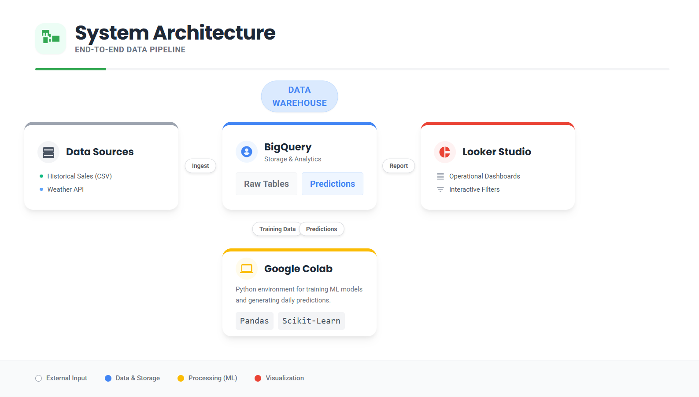
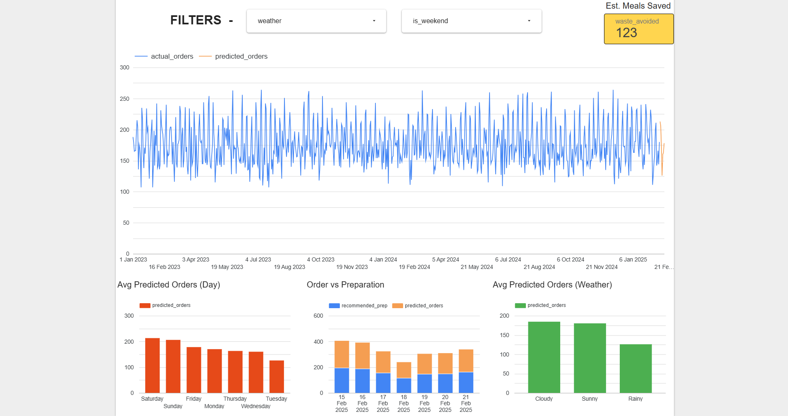

# 🍽️ Meal Predict
AI-powered demand forecasting and food-waste reduction system for small restaurants and cloud kitchens.

---

## 📌 Problem Statement
Small restaurants and cloud kitchens often rely on manual estimates to decide how much food to prepare each day. This can cause:

- Over-preparation and food waste
- Under-preparation and lost revenue
- Higher operating costs
- Limited data-driven planning

Affordable forecasting workflows are often too complex for small food businesses, so this project demonstrates a simple, practical alternative.

---

## 💡 Solution Overview
**Meal Predict** forecasts daily food demand and recommends preparation quantities using machine learning.

The system:

- Learns demand patterns from historical data
- Predicts future orders from day type, weather, and temperature
- Recommends how much food to prepare
- Estimates food waste avoided
- Visualizes business insights through dashboard-ready data

> To demonstrate scalability, the solution uses realistic simulated data that reflects restaurant demand patterns.

---

## 🚀 Key Features
- Daily demand prediction using machine learning
- Recommended food preparation quantity
- Estimated food waste avoided
- Historical vs predicted demand comparison
- Day-wise and weather-wise demand analysis
- Sample data and SQL view for dashboarding
- Scalable structure for future real restaurant data

---

## 🧠 Model Details
- **Model Used:** Random Forest Regressor
- **Input Features:** day of week, weekend/weekday, weather condition, temperature
- **Target Variable:** number of orders
- **Evaluation Metric:** Mean Absolute Error (MAE)

Categorical features are encoded internally for training, while outputs remain human-readable for reporting and dashboards.

---

## 🏗️ System Architecture



```text
Historical / simulated sales data
        ↓
Data generation and cleaning notebooks
        ↓
Random Forest demand forecasting model
        ↓
Predicted orders + recommended preparation
        ↓
BigQuery SQL view
        ↓
Looker Studio dashboard
```

---

## 🛠️ Google Technologies Used
- **Google BigQuery**: stores historical and predicted sales data and enables analytical queries.
- **Google Colab**: supports data generation, model training, and future demand prediction.
- **Google Looker Studio**: visualizes insights through an interactive dashboard.

All tools can be used in a free/prototype-friendly workflow.

---

## 🗂️ Repository Structure

```text
assets/
  architecture_diagram.png
  dashboard_screenshot.png
data/
  daily_sales_sample.csv
  predicted_orders_sample.csv
notebooks/
  01_data_generation.ipynb
  02_model_training.ipynb
  03_prediction_and_decision.ipynb
sql/
  actual_vs_predicted.sql
requirements.txt
README.md
```

---

## 📊 Dataset Description

### `daily_sales`
| Column | Description |
|---|---|
| date | Date |
| day | Day of week |
| is_weekend | Boolean weekend flag |
| weather | Weather condition |
| temperature | Temperature in Celsius |
| orders | Actual number of orders |

### `predicted_orders`
| Column | Description |
|---|---|
| date | Future date |
| day | Day of week |
| is_weekend | Boolean weekend flag |
| weather | Weather condition |
| temperature | Temperature in Celsius |
| predicted_orders | Forecasted demand |
| recommended_prep | Suggested preparation quantity |
| waste_avoided | Estimated food waste avoided |

---

## ⚙️ How to Run

1. Install dependencies:

```bash
pip install -r requirements.txt
```

2. Run the notebooks in order:

```text
notebooks/01_data_generation.ipynb
notebooks/02_model_training.ipynb
notebooks/03_prediction_and_decision.ipynb
```

3. Upload the generated or sample CSV files from `data/` to BigQuery.

4. Create the dashboard view using:

```text
sql/actual_vs_predicted.sql
```

5. Connect the BigQuery view to Looker Studio and build dashboard charts.

---

## 🧾 BigQuery View Used

```sql
CREATE OR REPLACE VIEW `restaurant_data.actual_vs_predicted` AS

SELECT
  date,
  orders AS actual_orders,
  NULL AS predicted_orders,
  NULL AS recommended_prep,
  NULL AS waste_avoided,
  day,
  weather,
  is_weekend,
  temperature
FROM `restaurant_data.daily_sales`

UNION ALL

SELECT
  date,
  NULL AS actual_orders,
  predicted_orders,
  recommended_prep,
  waste_avoided,
  day,
  weather,
  is_weekend,
  temperature
FROM `restaurant_data.predicted_orders`;
```

---

## 📈 Dashboard Preview



---

## 🚀 Future Improvements
- Replace simulated data with real restaurant order history.
- Add holiday, event, discount, and local calendar features.
- Track model accuracy over time.
- Add an automated daily prediction pipeline.
- Compare Random Forest with XGBoost or time-series forecasting models.
